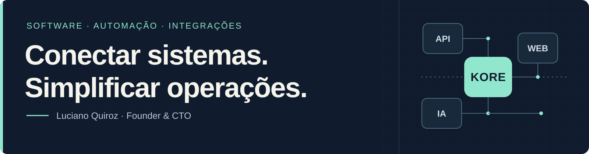

# Luciano Nicolás Quiroz Gutiérrez

**Founder & CTO · Kore Soluções**  
Belo Horizonte, MG · Português fluente · Espanhol nativo

[Site da Kore Soluções](https://koresolucoes.com.br) · [LinkedIn](https://www.linkedin.com/in/lucianonqgutierrez) · [Projetos](#projetos-selecionados)

Desenvolvo soluções web, automações e integrações para apoiar a operação de empresas. Minha atuação também inclui implantação e treinamento de equipes para usar essas soluções no dia a dia.

## O que faço

- **Automação e integrações** · Fluxos com n8n, APIs e ferramentas de atendimento
- **Desenvolvimento web** · Interfaces e aplicações com TypeScript, React, Next.js e Angular
- **Implantação e treinamento** · Configuração de ferramentas, adaptação de processos e capacitação de equipes

## Projetos selecionados

### 01 · DevTools Hub
[Ver repositório →](https://github.com/koresolucoes/devtools-hub)

Ferramenta para análise de repositórios, com verificações por regras e geração de pipelines. O código inclui testes e cenários de referência para o analisador.

**React · TypeScript · Vite · Vitest**

### 02 · Kore Site
[Ver repositório →](https://github.com/koresolucoes/koresite)

Projeto de site institucional e conteúdo educacional, com componentes reutilizáveis e configuração de publicação no GitHub Pages.

**Next.js · React · TypeScript · Tailwind CSS**

### 03 · Liga dos Botecos
[Ver repositório →](https://github.com/koresolucoes/ligadosbotecos)

Landing page com jogos interativos e formulário de lista de espera. Um projeto que reúne interface, interação e integração com dados.

**Angular · TypeScript · Supabase**

Os links levam ao código dos projetos. Consulte cada repositório para conhecer sua configuração, escopo e estágio de desenvolvimento.

## Experiência aplicada

**Atendimento e automação para uma rede de academias**

Projeto concluído de implantação e treinamento para atendimento por WhatsApp, com configuração por unidade. O trabalho envolveu n8n, Chatwoot, integrações com a Meta e recursos de IA com Gemini e OpenAI.

## Formação e ferramentas

**Engenharia de Software · Descomplica**  
Graduação em andamento, atualmente no 2º período.

- **Automação e atendimento:** n8n, Chatwoot, WhatsApp e APIs da Meta
- **Web:** TypeScript, JavaScript, React, Next.js e Angular
- **Dados e IA:** Supabase, integrações com OpenAI e Gemini

---

**Vamos conversar sobre um projeto?**  
[Conheça a Kore Soluções](https://koresolucoes.com.br) ou [fale comigo no LinkedIn](https://www.linkedin.com/in/lucianonqgutierrez).
